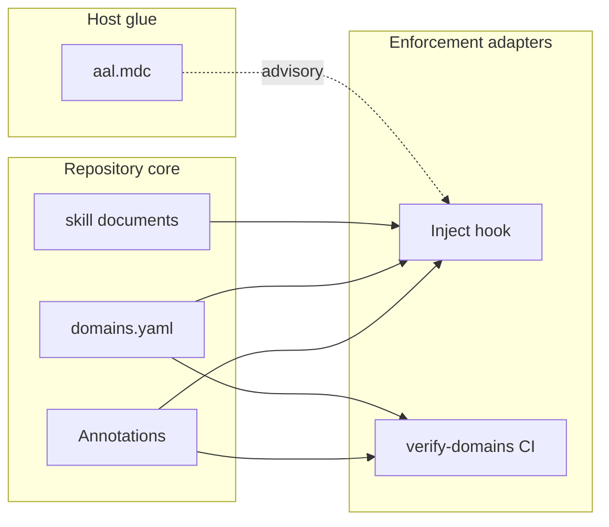

# [DRAFT] HLD: Agentic Annotation Language (AAL)

**Version:** 1.3.0 · **Status:** Draft for design review
**Audience:** Executives, product and architecture reviewers
**Lower-level detail:** [Specification](./AAL-v1.3.0.md) · [Deployment guide](./AAL-deployment-guide.md) · [Examples](./AAL-examples.md) · [Implementation backlog](./AAL-implementation-backlog.md)

---

## 1. Introduction

This document repositions agent guidance from **monolithic, out-of-band instruction**—global rule files, wikis, and undifferentiated prompt lore—into a **distributed, in-band contract** linked directly to the code autonomous agents edit. Rather than loading the same organizational handbook on every session regardless of file or function, AAL binds **domain practice documents** to annotated regions of source through a one-line comment syntax and resolves them mechanically at edit time.

Recognizing that repositories have varying maturity and that teams adopt agent tooling at different speeds, we adopt a **progressive onboarding model** centered on committed repository artifacts. Domains can prioritize what they need first—local inject and skills, bulk annotation of legacy code, CI merge gates—and onboard capabilities in an order that aligns with their roadmaps. This ensures AAL remains a value-add **practice layer** that leverages existing code review, access control, and CI without replacing them.

### 1.1 Platform-Enabled Agent Guidance

While the industry often treats agent instructions as ad hoc prompt engineering, this design advocates for a model where **specialized enforcement**—inject-on-edit, domain registry validation, bootstrap tooling—is provided as **cross-cutting platform services** installed into each repository. By having code declare its domain scope through native annotations and publish that contract through a governed registry, we decouple **practice content** (skill documents) from **enforcement mechanics** (hooks, CI).

This approach provides a more stable ecosystem where application teams focus on **domain correctness**—accurate annotations, maintained skill overrides, P0 coverage—without building inject infrastructure, hook scripts, or validation logic locally. The package provides the stable adapters; the repository provides the content and annotations.

**Benefits for matrixed engineering organizations:**

- **Optimizing platform talent:** Agent-hook engineers and skill-library maintainers can serve many repos from a single installable package rather than duplicating Cursor rules and wikis per team.
- **Accelerating adoption:** Product teams focus on annotating their modules and authoring overrides—not on wiring `preToolUse` hooks or CI validators from scratch.
- **Ensuring consistency:** A committed `.cursor/domains.yaml` and skill tree in git ensures every developer and every CI run resolves the same domain names to the same practice documents at merge time.

#### 1.1.1 Comparison: Global Rules vs. In-Band Annotations

The table below compares the proposed in-band model against continuing with global Cursor rules and wikis alone.

| Feature | In-Band AAL (Proposed) | Global Rules / Wikis Only |
|---------|------------------------|---------------------------|
| **Scope** | File and function via `# @!domain` | Directory globs or session-global |
| **Link to code** | Annotation travels with refactors in git | Lore drifts; no diff visibility |
| **Enforcement** | Mechanical inject hook + optional CI | Probabilistic; agent may ignore |
| **Context cost** | Domain skills for annotated region only | Full monolith loaded or ignored |
| **Validation** | `verify-domains` on changed files | None structural |
| **Audit** | Package pin + git snapshot of skills at merge | Informal |
| **Operational model** | Committed `.cursor/` + `.cursor/` tree | Scattered config; often gitignored |

For grammar, placement rules, and registry schema, see the [canonical specification](./AAL-v1.3.0.md).

### 1.2 Redefining the Agent Guidance Contract

In this model, the guidance contract is inverted from "load everything globally" to **declare scope locally**. A modern AAL-enabled module comprises:

- **Annotations** — one-line domain labels in source (`# @!code-review`, `# @!testing`), declaring which practice sets apply to a file or function.
- **Skill documents** — committed markdown under `.cursor/skills/`, describing preferred patterns and practices for each domain (testing conventions, style rules, documentation standards, security practices).
- **Enforcement** — inject hooks that load resolved skills before Write/Edit, and optionally CI that validates the annotation ↔ registry link on pull requests.

Crucially, these products are **non-symmetrical** across files: a homogeneous test module may carry a single domain; a data-and-auth module may carry two at file level (maximum three); a mixed-concern file may use a file default plus function-level overrides. This asymmetry allows the framework to scale organically without forcing every file into identical annotation shape.

AAL does **not** govern who may edit code or approve merges. It has nothing to do with GitHub permissions, branch protection, or CODEOWNERS. Those tools answer **who**; AAL answers **which practice documents apply to the region being edited** and whether that link is enforced at edit time and/or in CI.

### 1.3 Parallel Strategic Evolution

The **specification** (annotation syntax, registry, validation rules) evolves on a versioned standard—today v1.3.0. The **implementation** targets the existing **axiompy** repository (`axiompy-skills` CLI, bundled skills), while spec drafts retain placeholder names (`axiompy`, `aal`) until registry path and skill format are reconciled. See [Open decisions](#7-open-decisions) and the [implementation backlog](./AAL-implementation-backlog.md).

By anchoring practice text in committed skill files and scope in source annotations, teams can evolve domain content without re-platforming hooks. Platform upgrades (`pip install -U` + `axiompy-skills upgrade`) refresh manifest-managed templates; organization rules in `<domain>.override/SKILL.md` are preserved.

---

## 2. Architectural Paradigm Shift

The transition to AAL is driven by four axioms that alter how we perceive the relationship between code, agents, and guidance:

**1. Context is dependency.** Skill documents are versioned artifacts—pinned package plus committed repository tree—maintained like libraries, not wiki pages. Six months after a merge, provenance is the package pin and the git snapshot of `.cursor/skills/` at the merge commit, not inline hashes in source. Details: [spec §8 audit model](./AAL-v1.3.0.md), [deployment guide §9](./AAL-deployment-guide.md).

**2. Scope before volume.** Inject loads skills for the **annotated region**—file default plus function override—not organizational monoliths on every keystroke. This directly addresses token bloat and irrelevant context.

**3. Native coexistence.** AAL lives in host-language comments. Zero runtime and compile impact. Reviewers see domain intent in the pull request diff.

**4. Explicit scope, shared bootstrap.** Teams declare `# @!domain`; the package supplies default skills and install templates; `<domain>.override/SKILL.md` captures organization-specific rules without editing bundled files in place.

**The pull vs. push dynamic:** Traditional agent guidance **pushes** global lore into every session. AAL **pulls** the relevant practice documents when an edit touches an annotated region—via `axiompy-skills resolve` in the inject hook—based on what the code declares.

---

## 3. The AAL Structure

### 3.1 Three Layers: Contract, Policy, and Host Glue

Communication between source code, practice content, and agent hosts is managed through three distinct layers:

- **Contract (annotations)** — `# @!domain` in source declares which domains apply to a file or function. This is the in-band, reviewable scope declaration.
- **Policy (skills + registry)** — `.cursor/domains.yaml` maps domain names to skill file paths; `.cursor/skills/` holds practice content. Multiple skills per domain are supported; inject loads all listed files for the effective annotation.
- **Host glue** — `.cursor/rules/aal.mdc` and optional `CLAUDE.md` describe **how to participate in AAL on this host** (respect annotations, trust inject). Installed with `axiompy-skills install --hooks`; **not** where domain policy text lives.

**Hooks** connect skills to edits: `preToolUse` → `axiompy-skills resolve` → inject. **CI** validates the committed registry and annotations on changed files. Removing glue does not disable AAL; removing annotations or hooks does.

For repository layout and file paths, see [deployment guide §4](./AAL-deployment-guide.md). For inject sequence diagrams, see [spec §7](./AAL-v1.3.0.md).

#### 3.1.1 Architectural Alternatives Considered

| Criterion | In-Band AAL (Proposed) | Path-Scoped Rules Only | Content Hashes in Source |
|-----------|------------------------|--------------------------|--------------------------|
| **Edit-time behavior** | Mechanical inject | Probabilistic rules | None at edit time |
| **Scope granularity** | File + function | Directory glob | Per-file hash churn |
| **Registry validation** | CI on committed tree | None | Hash mismatch failures |
| **Skill maintenance** | Live docs + git snapshot | N/A | High churn on skill edit |
| **Bootstrap legacy repos** | `bootstrap.yaml` + phase 1 apply | Manual rules only | Impractical |

Path-scoped Cursor rules alone were rejected as the primary model: coarse scope, no validated domain registry, no function-level precision in mixed files. Content hashes in annotations were rejected in v1.3 (see grill archive [Q4, Q6](./AAL-grill-questions.md)): operational churn without proportional benefit given git provenance.

### 3.2 The Core: Annotations and Registry

At the center of each AAL-enabled repository are **annotated source files** and a **domain registry**. Annotation placement follows strict rules so validation is deterministic: file-level annotations appear at the top of the file only; function-level overrides sit immediately above a function and supersede the file default. Implementations parse the **entire file** to discover overrides anywhere in the module.

Multi-domain annotations use comma-separated domain names, **maximum three**—for example `# @!code-review,storage` when the whole file legitimately requires both practice sets on every edit. More than one domain triggers a **warning** (mixed concerns); incompatible pairs configured in `bootstrap.yaml` (e.g. `customer` + `testing`) warn of likely bad module design. Prefer one domain at file level when possible; use function overrides when different functions need different subsets.

Full syntax and placement rules: [spec §2 and §4](./AAL-v1.3.0.md). Examples: [AAL-examples.md](./AAL-examples.md).

### 3.3 Enforcement Adapters

**Inject adapter (edit time).** Before Write/Edit on an annotated region, the host invokes `axiompy-skills resolve --file PATH --line N`. The resolver returns skill content JSON for injection. Invalid domains or missing skill files fail the hook—same rules as `verify-domains`. The user does not run CLI commands during a normal edit.

**Validation adapter (merge time).** CI runs `axiompy-skills doctor --strict` and `axiompy-skills verify-domains --strict --files` on changed paths in the pull request. CI checks out the **committed** tree—it does not run `axiompy-skills install` or inject. Structural validity only; CI does not prove the agent followed every bullet in a skill document.

One validator implementation serves hook, pre-commit, and CI. Contract: [spec §8.1](./AAL-v1.3.0.md).

### 3.4 Host Glue

`.cursor/rules/aal.mdc` is **host-specific workflow glue**, installed alongside the inject hook. It tells agents not to strip `# @!` annotations, to trust injected context, and to run verification when appropriate. It does **not** contain security, testing, or style policy—that belongs in skill documents.

Claude and other hosts use the same `axiompy-skills resolve` API via middleware (post-MVP). MVP ships Cursor only.

---

## 4. Enforcement Paths

Two paths compose the recommended rollout. They answer different questions and should both be adopted; neither replaces the other.

### 4.1 Path A: Inject-First (Edit-Time Behavior)

Inject-first is the **primary behavioral lever**. Without it, annotations are labels and global rules remain probabilistic.

After `axiompy-skills install --hooks`, every edit on an annotated region loads domain skills before the agent writes code. Net-new files receive inject as soon as they carry an annotation—via `axiompy-skills init` or a manually added file-level `# @!domain`. Existing repositories require bootstrap (Section 5).

**Pros:** Mechanical enforcement; scoped context; immediate local value; same resolution logic as CI.

**Cons:** Coverage-dependent—unannotated files get no inject; requires skill and package maintenance; Cursor-native in MVP (Claude needs adapter).

**Summary:** Non-negotiable core of AAL. See [deployment guide §3](./AAL-deployment-guide.md).

### 4.2 Path B: Inject + CI (Merge-Time Contract)

Inject + CI adds a merge gate validating structural integrity on every pull request—typically **week two** after local bootstrap.

Workflow: checkout committed tree → install pinned package → `axiompy-skills doctor --strict` → `axiompy-skills verify-domains --strict --files $(changed)`. Validates domains exist, skills are on disk, placement rules hold, multi-domain cap respected.

**Pros:** Prevents team-wide drift; auditable; pairs with package pin.

**Cons:** Does not inject; requires committed `.cursor/` and `.cursor/`; legacy paths only gated when touched (changed-files scope in MVP).

| CI scope | Pros | Cons |
|----------|------|------|
| Changed files (MVP) | Fast PR feedback | Unannotated legacy not gated until edited |
| Full repo nightly (post-MVP ops) | Complete signal | Heavier |

**Summary:** Adopt by week two. Template: [deployment guide §8](./AAL-deployment-guide.md).

---

## 5. The Progressive Onboarding Journey

The onboarding journey meets repositories at their current maturity while providing a clear path toward full AAL participation. Instead of a mandatory big-bang annotation of every file, teams navigate incremental stages where each step unlocks new value.

### 5.1 Stage 1: Local Install (Week One)

Teams run `axiompy-skills install --hooks`, pin the package in `requirements-dev.txt`, and **commit** the provisioned tree: `.cursor/` (registry, skills, manifest, example `bootstrap.yaml`), `.cursor/` (inject hook, host glue), and CI workflow template. Do not gitignore project hooks.

At this stage, inject works on **already-annotated** files. The install does not annotate legacy code automatically. Smoke-test by editing a manually annotated file and confirming skill content loads.

Commands and path table: [deployment guide §1](./AAL-deployment-guide.md).

### 5.2 Stage 2: Bootstrap Phase 1 — File-Level Annotations

Legacy repositories annotate P0 paths in bulk through a **safe automatic phase**: one `# @!domain` at each file top.

1. Author `.cursor/bootstrap.yaml` with P0 globs, path hints, default domain, incompatible pairs.
2. Run `axiompy-skills bootstrap suggest` — review file → domain → confidence → warnings.
3. Run `axiompy-skills bootstrap apply --level file` (`--dry-run` first).
4. Commit; verify inject on representative modules.

Path hints are the primary signal (`src/auth/**` → `security`). Low-confidence rows (default domain only) deserve review before apply. Homogeneous single-domain files are **done** after this stage.

Schema and algorithm: [spec §5.2](./AAL-v1.3.0.md). Operational detail: [deployment guide §1.1](./AAL-deployment-guide.md).

### 5.3 Stage 3: CI Merge Gate (Week Two)

Enable the bundled `aal-gate.yml` workflow on pull requests. Non-waivable on protected branches once the team commits to the contract. Tracks `% P0 modules annotated` and PR pass rate on `verify-domains --files` as health metrics.

### 5.4 Stage 4: Function-Level Refinement (Post-MVP)

Mixed-concern files—where file-level default is wrong for specific functions—enter a **prompted** phase. Tooling flags files via `bootstrap refine` or incompatible-pair warnings; humans or agents confirm function-level `# @!domain` overrides. No bulk auto-apply at function scope.

When whole-file multi-domain is correct (≤3 domains, same mix everywhere), stay at file level. When one function differs, prefer `# @!general` at file top and `# @!code-review` above the sensitive function—not `# @!general,security,testing` on the entire module.

Deferred CLI: `bootstrap refine`, `annotate --function`, `coverage report`. MVP scope: [spec §8.2](./AAL-v1.3.0.md).

---

## 6. Recommendation

We recommend adopting **AAL v1.3** as the standard for connecting agent-edited code to domain practice documents, implemented through the **minimum loop**:

1. **Install** — `axiompy-skills install --hooks`; commit `.cursor/` and `.cursor/`.
2. **Annotate** — bootstrap phase 1 on P0 paths; manual or `axiompy-skills init` for new files.
3. **Inject** — Cursor `preToolUse` hook via `axiompy-skills resolve`.
4. **Verify** — CI on changed files by week two.

**Ship in MVP:** compact syntax (multi-domain max 3), registry and overrides, bootstrap phase 1, inject, `verify-domains --files`, Cursor host.

**Defer post-MVP:** bootstrap phase 2, guards ([spec §3](./AAL-v1.3.0.md)), directory defaults, diagnostics CLI (`explain`, `impact`), Claude middleware, skill severity levels, skill-import alignment.

**Assign an AAL steward** before broad rollout—platform or architecture owner for upgrade cadence, bootstrap coverage, and override review.

Build order: [implementation backlog](./AAL-implementation-backlog.md).

---

## 7. Open Decisions

| # | Question | Options | Notes |
|---|----------|---------|-------|
| 1 | Registry + manifest path | `.cursor/` · `.axiompy/` · `.cursor/` only | Spec uses `.cursor/` today |
| 2 | Rename placeholders → axiompy | HLD sign-off · spec v1.4 · implementation PR | Implementation home is axiompy |
| 3 | Skill format | Flat `.md` (spec) · `SKILL.md` folders (axiompy) | Must reconcile before build |
| 4 | MVP host | Cursor only (recommended) · Claude stub | MVP = Cursor only |

---

## 8. Risks and Stewardship

**Ranked adoption risks:**

1. **Maintenance of the package and skills (highest).** Without upgrade ownership, skills drift, overrides proliferate, and agents ignore stale guidance. Mitigation: named steward, scheduled `axiompy-skills upgrade` PRs after `pip install -U`, `axiompy-skills doctor --strict` on main.

2. **Coverage on existing code (second).** Unannotated legacy paths never trigger inject. Mitigation: bootstrap phase 1, P0 targets, CI on changed files as modules are touched.

**Future mitigation:** skill rule severity (`error`, `warning`, `info`) for progressive enforcement—post-MVP; avoids sweeping breaking changes during bootstrap and verify.

**Success metrics:** % P0 modules with `# @!domain`; PR pass rate on `verify-domains --files`; time from `install` to first green CI; upgrade PRs without `doctor` drift.

---

## 9. Frequently Asked Questions

**Q1: What problem does AAL solve?**
Agents editing code need scoped, current domain guidance—not monolithic global rules loaded on every session. AAL links the region being edited to the right practice documents and loads them mechanically at edit time. Optionally, CI validates that the link between annotations and skill files remains structurally sound on each pull request.

**Q2: Does AAL govern code or replace CODEOWNERS and GitHub permissions?**
No. AAL has nothing to do with merge approval, CODEOWNERS, or repository permissions. Those control **who** may change code and **who must approve**. AAL controls **which domain practice documents apply** to an annotated region. Comparing AAL to access control is a category error.

**Q3: What do `# @!domain` annotations actually do?**
They declare that this file or function follows the patterns and practices of the named domain(s)—testing, code-style, security practices, and so on. The registry maps names to skill files. Annotations do not load content by themselves; the inject hook and `axiompy-skills resolve` do. Syntax detail: [spec §2](./AAL-v1.3.0.md).

**Q4: How is AAL enforced—rules, hooks, or CI?**
**Hooks** enforce behavior at edit time; they are non-negotiable for AAL's value. **CI** validates structure at merge time; adopt week two. **Host glue** (`.cursor/rules/aal.mdc`) advises agent workflow; installed with hooks but advisory only. `axiompy-skills install --hooks` ships hooks and glue together—not separate layers to choose among.

**Q5: Aren't path-scoped Cursor rules enough?**
Path rules are directory-coarse, probabilistic, and not tied to a validated domain registry in git. They do not provide function-level scope in mixed-concern files or machine-verifiable annotation resolution on pull requests. Rules can supplement AAL as glue; they do not replace inject.

**Q6: Why comments in source instead of configuration-only mapping?**
Annotations live beside the code they scope. Reviewers see domain intent in the diff; inject resolves at the exact line being edited; CI validates changed files in isolation. Config-only maps without annotations do not appear in code review or travel cleanly with refactors.

**Q7: Can one annotation list multiple domains?**
Yes—comma-separated, **maximum three**, when the whole file or function legitimately needs all listed practice sets on every edit. More than one domain on a file triggers a warning suggesting mixed concerns. Never exceed three; `verify-domains --strict` errors if you do.

**Q8: When should I use file-level vs. function-level annotations?**
Use file-level at the top for homogeneous modules. Use function-level immediately above a function when it needs a different domain than the file default. Do not pile multiple domains on the file when function overrides express the intent more clearly.

**Q9: Does CI prove agents followed the skills?**
No. CI proves the **contract is structurally valid**—domains exist, skills present, placement rules met. Behavioral compliance comes from inject at edit time plus human code review.

**Q10: What happens on `pip install -U` vs. `axiompy-skills upgrade`?**
`pip` updates the tooling package only. Run `axiompy-skills upgrade --force` to replace manifest-managed paths from the package. `<domain>.override/SKILL.md` and `domains.local.yaml` are preserved. Commit the refreshed tree. Operational detail: [deployment guide §9](./AAL-deployment-guide.md).

**Q11: How do we bootstrap annotations on existing code?**
Two phases. **Phase 1 (MVP):** configure `.cursor/bootstrap.yaml`, run `bootstrap suggest`, review, `bootstrap apply --level file`. **Phase 2 (post-MVP):** `bootstrap refine` for mixed-concern files with prompted function overrides. Install alone does not annotate legacy files.

**Q12: What determines the correct domain per file during bootstrap?**
Primarily **path hints** in `bootstrap.yaml` (e.g. `src/auth/**` → `security`). Fallback **default domain** when no hint matches—review low-confidence suggestions. Optional future signals: imports, `.aal-dir.yaml`. Full schema: [spec §5.2](./AAL-v1.3.0.md).

**Q13: What are incompatible domain pairs?**
Configurable warnings in `bootstrap.yaml`—for example `customer` + `testing` suggests misplaced test code or poor module boundaries. Bootstrap warns; do not silently bulk-apply such suggestions.

**Q14: What's the difference between skills, hooks, and rules?**
**Skills** are domain practice content (the *what*). **Hooks** mechanically inject at edit time (connect skills to edits). **Rules / CLAUDE.md** are host glue for AAL workflow (the *how* on this host)—not policy text.

**Q15: Can I edit bundled skill files in place?**
No. Use `<domain>.override/SKILL.md` beside the bundled file. Bundled paths are replaced on `axiompy-skills upgrade`; overrides are preserved. Override format: [spec §5.1](./AAL-v1.3.0.md).

**Q16: Should we gitignore `.cursor/`?**
No, for team AAL repositories. Hooks and glue are part of the committed contract CI validates.

**Q17: What's the biggest adoption risk?**
Ranked: (1) maintenance—package and skill drift without an owner; (2) coverage—existing code never annotated, so inject never fires. Mitigation: named steward, bootstrap phase 1, CI on changed files.

**Q18: What is in MVP vs. post-MVP?**
MVP: syntax, registry, install/upgrade, inject, bootstrap phase 1, verify on changed files, Cursor host. Post-MVP: bootstrap phase 2, guards, Claude middleware, skill severity, diagnostics CLI. Checklist: [spec §8.2](./AAL-v1.3.0.md).

**Q19: Six months later, what skill text governed a merged pull request?**
Dual provenance: pinned package version in `requirements-dev.txt` and git snapshot of `.cursor/skills/` plus overrides at the merge commit SHA. v1.3 does not embed content hashes in source annotations.

**Q20: Will Claude work in MVP?**
Not as a first-class host. The middleware API is specified for post-MVP; same skills and registry, different host adapter. Cursor `preToolUse` hooks are the MVP enforcement surface.

**Q21: Where do import rules (e.g. "use bcrypt") belong?**
In skill documents for the domain—not in annotation syntax or guard predicates. Guards are advanced optional ([spec §3](./AAL-v1.3.0.md)); not MVP.

**Q22: Why two package names—`axiompy` and `aal`?**
Normal Python packaging: distribution name vs. short CLI. Use `axiompy-skills doctor`, venv-safe hook invocation. Implementation targets **axiompy** / `axiompy-skills`.

---

## Appendix A — Related Documents

| Document | Use when you need |
|----------|-------------------|
| [AAL-v1.3.0.md](./AAL-v1.3.0.md) | Grammar, placement, registry schema, CLI contracts, MVP checklist |
| [AAL-deployment-guide.md](./AAL-deployment-guide.md) | Install commands, CI workflow, rollout phases, troubleshooting |
| [AAL-examples.md](./AAL-examples.md) | Copy-paste annotation patterns |
| [AAL-implementation-backlog.md](./AAL-implementation-backlog.md) | Build order, axiompy mapping, phased delivery |
| [AAL-grill-questions.md](./AAL-grill-questions.md) | Design review Q&A archive (18 questions) |
| [AAL-project-todo.md](./AAL-project-todo.md) | Project checklist and decision log |

---

## Appendix B — Design Decision Summary

Consolidated from v1.3 spec and design review. Full normative rules: [AAL-v1.3.0.md](./AAL-v1.3.0.md).

| Topic | Decision |
|-------|----------|
| Syntax | `# @!domain`; comma-separated multi-domain; max 3 |
| Vocabulary | Domain-only; no separate scope labels |
| Placement | File-level top only; function overrides |
| Parsing | Whole-file scan (`scan_entire_file: true`) |
| Skills | Committed; overrides via `<domain>.override/SKILL.md` |
| Upgrade | `axiompy-skills upgrade` after `pip install -U`; full manifest overwrite |
| Repo policy | Commit `.cursor/` + `.cursor/` |
| CI | `doctor --strict` + `verify-domains --files` on changed paths |
| Bootstrap | Phase 1 auto file-level; phase 2 prompted function (post-MVP) |
| Host glue | Installed with hooks; not policy |
| What AAL is not | Access control, CODEOWNERS substitute |
| Implementation | axiompy (spec placeholders until reconciled) |

---

*End of document.*
