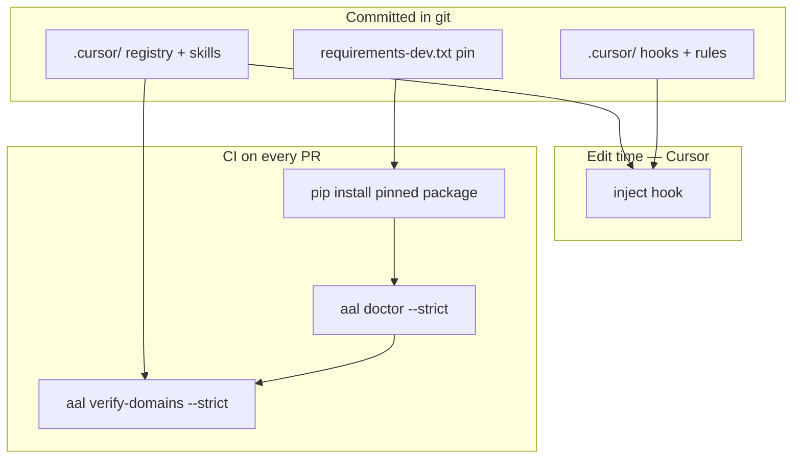
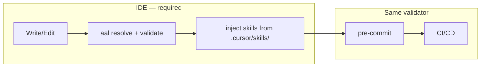
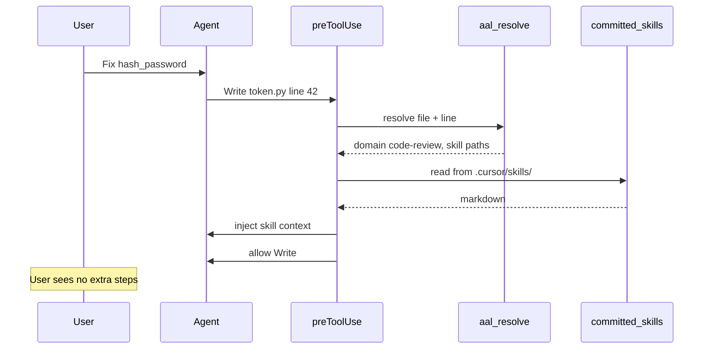

# AAL Deployment & Shipping Guide

**Agentic Annotation Language v1.3.0**

Narrative guide for bootstrapping a new repository, rolling out AAL with **inject-on-edit**, and operating across **Cursor** and **Claude** environments.

> **Canonical spec:** [AAL-v1.3.0.md](./AAL-v1.3.0.md) · **Examples:** [AAL-examples.md](./AAL-examples.md)

---

## Table of contents

1. [Install in 60 seconds](#1-install-in-60-seconds)
2. [What you are building](#2-what-you-are-building)
3. [Enforcement: inject-on-edit](#3-enforcement-inject-on-edit)
4. [Repository layout (committed)](#4-repository-layout-committed)
5. [Rollout phases](#5-rollout-phases)
6. [Shipping in Cursor](#6-shipping-in-cursor)
7. [Shipping in Claude environments](#7-shipping-in-claude-environments)
8. [CI/CD](#8-cicd)
9. [Day-2 operations](#9-day-2-operations)
10. [Troubleshooting](#10-troubleshooting)

---

## 1. Install in 60 seconds

```bash
pip install axiompy

mkdir my-service && cd my-service
git init
aal install --hooks --setup-pre-commit

# Pin dependency and commit the provisioned tree
echo "axiompy==1.3.0" >> requirements-dev.txt
git add .cursor/ .cursor/ .github/ requirements-dev.txt .pre-commit-config.yaml
git commit -m "chore: bootstrap AAL"

aal init src/auth/token.py --domain code-review
aal verify-domains --strict
```

`axiompy-skills install --hooks` writes **project-scoped, committable** artifacts:

| Path | Purpose | Commit? |
|------|---------|---------|
| `.cursor/domains.yaml` | Domain → skill file mapping | **Yes** |
| `.cursor/skills/` | Bundled skill markdown from package | **Yes** |
| `.cursor/aal.yaml` | Config including `enforcement: inject` | **Yes** |
| `.cursor/.axiompy-manifest.json` | Paths replaced by `axiompy-skills upgrade` | **Yes** |
| `.cursor/rules/aal.mdc` | Host glue — AAL workflow on Cursor (not policy) | **Yes** |
| `.cursor/hooks.json` + `hooks/` | Inject hook | **Yes** |
| `.github/workflows/aal-gate.yml` | CI gate | **Yes** |

**Do not gitignore `.cursor/`** in AAL-enabled repos. Hooks and skills must exist in the PR tree CI checks out.

**No** `freeze`, **no** hashes, **no** in-place edits to bundled skills — use `<domain>.override/SKILL.md` (spec §5.1).

### 1.1 Existing code — two-phase bootstrap

`axiompy-skills install --hooks` provisions tooling; it does **not** annotate legacy files.

**Phase 1 — File-level (automatic):** Scan P0 paths → suggest domain from path heuristics → `axiompy-skills bootstrap apply --level file` inserts one `# @!domain` at each file top. Homogeneous files are done; inject works on the next edit.

**Phase 2 — Function-level (prompted):** `axiompy-skills bootstrap refine` flags mixed-concern files; tooling prompts which functions need overrides (§4.2). User or agent confirms — do not bulk-auto-annotate functions.

| Scenario | Phase |
|----------|-------|
| Whole repo P0 tree | Phase 1 bulk, then Phase 2 on flagged files |
| New file | `axiompy-skills init` — file-level at create |
| Agent edits mixed file | Host glue: suggest function-level override when domain differs from file default |

Example `.cursor/bootstrap.yaml`:

```yaml
p0_globs:
  - "src/**"
default_domain: general
max_domains_per_annotation: 3   # hard cap; verify-domains --strict enforces

path_hints:
  - glob: "src/auth/**"
    domain: security
  - glob: "src/payments/**"
    domains: [security, storage]   # multi-domain when whole tree needs both

incompatible_pairs:              # bootstrap warning — likely bad module design
  - [customer, testing]
  - [customer, documentation]

warn_if_domains_count_gt: 1      # file-level: more than one domain → review
```

See [AAL-project-todo.md](./AAL-project-todo.md) HLD FAQ for full workflow.

After `pip install -U axiompy`:

```bash
aal upgrade --force
aal doctor --strict
aal verify-domains --strict
git add .cursor/ .cursor/ requirements-dev.txt
git commit -m "chore: upgrade axiompy"
```

---

## 2. What you are building

AAL links code to **domain skill documents** with one-line annotations:

```python
# @!code-review
```

Skills live in **committed** `.cursor/skills/`. Inject hooks read the same files locally that CI validates on every PR.



### Success criteria

1. Sensitive modules annotated with `# @!code-review` (or relevant domain).
2. **`.cursor/hooks/` committed** — inject runs on every guarded edit.
3. **`.cursor/skills/` committed** — CI can verify skill paths exist.
4. CI runs `axiompy-skills doctor --strict` and `axiompy-skills verify-domains --strict` on every PR.
5. Package upgrades use `axiompy-skills upgrade` and commit refreshed manifest paths.
6. Company rules use `<domain>.override/SKILL.md` — never edit bundled skills in place.

---

## 3. Enforcement: inject-on-edit + unified validation

### Two jobs, one validator

| Job | Where | What |
|-----|-------|------|
| **Inject skills** | Committed Cursor hook | Automatic, transparent — primary guard |
| **Validate annotations** | Hook + pre-commit + CI | Same `verify-domains` rules against **committed files** |



### Why local and CI must match

CI validates the **same committed tree** local hooks use. If skills or hooks are missing from git, CI fails before merge.

**Rule:** One implementation in `verify-domains`; `resolve` calls the same core; pre-commit and CI use identical flags.

```bash
aal doctor --strict
aal verify-domains --strict
```

### Inject flow



### Configuration

**`.cursor/aal.yaml`**

```yaml
enforcement: inject   # default — use cache or deny only if needed
skills_package: axiompy
skills_package_version: "1.3.0"
scan_entire_file: true   # default — scan whole file for annotations (spec §4.5)
```

| Mode | When to use |
|------|-------------|
| `inject` | Default — silent prefetch on every annotated edit |
| `cache` | Same UX; inject once per domain per session |
| `deny` | Compliance mode — block Write until explicit Read |

### Resolution rules

1. Parse the **entire file** to build a scope map (§4.5).
2. **File-level** `# @!domain` at top → default for whole file.
3. **Function-level** `# @!domain` → overrides file default for that function.
4. `resolve(file, line)` → function override > file default > directory default (`.aal-dir.yaml`).
5. Inject all skills for effective domain(s). Guards (spec §3) are optional advanced usage.

With **`scan_entire_file: true`** (default), long license headers and import blocks do not affect discovery. File-level annotations **must** stay at the top (§4.1).

---

## 4. Repository layout (committed)

```text
my-service/
├── .cursor/
│   ├── aal.yaml
│   ├── domains.yaml
│   ├── .axiompy-manifest.json
│   ├── domains.local.yaml         # optional; not in manifest
│   └── skills/
│       ├── security/
│       │   ├── core.md
│       │   └── core.override.md   # company rules; never overwritten
│       └── storage/
│           └── sql.md
├── .cursor/                       # DO NOT gitignore
│   ├── rules/aal.mdc
│   ├── hooks.json
│   └── hooks/aal-inject.sh
├── requirements-dev.txt           # axiompy==X.Y.Z
├── .github/workflows/aal-gate.yml
├── .pre-commit-config.yaml
├── CLAUDE.md                      # optional (--claude)
└── src/
    └── auth/
        ├── .aal-dir.yaml          # optional: domain: security
        └── token.py               # # @!code-review
```

### Commit policy

| Do | Don't |
|----|-------|
| Commit `.cursor/` and `.cursor/` after install/upgrade | Gitignore project hooks or skills |
| Pin `axiompy` in `requirements-dev.txt` | Rely on global `~/.cursor/skills` only for team repos |
| Use `<domain>.override/SKILL.md` for company rules | Edit bundled `core.md` in place |
| PR includes manifest refresh with dependency bump | Run `axiompy-skills install` in CI instead of validating commits |

---

## 5. Rollout phases

| Phase | Goal | Actions |
|-------|------|---------|
| **1 — Local bootstrap (week one)** | Full committed install | `axiompy-skills install --hooks` → commit `.cursor/` + `.cursor/` (hooks, rules glue, skills, registry) → annotate P0 paths → smoke-test inject |
| **2 — Coverage** | Expand annotations | `axiompy-skills init --domain code-review` on auth/crypto/migrations |
| **3 — CI** | Merge gate (week two+) | Pin `requirements-dev.txt`; enable `aal-gate.yml`; `doctor --strict` + `verify-domains --strict --files` |
| **4 — Claude** | Parity | `CLAUDE.md` + middleware reading same `.cursor/skills/` paths |

---

## 6. Shipping in Cursor

### 6.1 Host glue — path-scoped rules (installed with hooks)

**`.cursor/rules/aal.mdc`** — **host-specific glue**, installed with `axiompy-skills install --hooks` alongside the inject hook. Not policy — hooks connect skills to edits; rules tell agents how to participate in AAL on Cursor (respect annotations, trust inject). Do not put domain policy here — that belongs in `.cursor/skills/`.

Key instructions for agents:

- Compact syntax: `# @!code-review` or `# @!code-review,storage` — load implied.
- Function-level annotations override file-level; renaming a function does not remove its annotation.
- Import/library rules live in skill files — not in guard syntax.
- Hooks inject skills from committed `.cursor/skills/` — use injected context.
- Do not edit bundled skills; use `<domain>.override/SKILL.md` for company rules.

### 6.2 Inject hook (required — part of `install --hooks`)

**`.cursor/hooks.json`**

```json
{
  "version": 1,
  "hooks": {
    "preToolUse": [
      {
        "command": ".cursor/hooks/aal-inject.sh",
        "matcher": "Write|Edit",
        "failClosed": false
      }
    ]
  }
}
```

**`.cursor/hooks/aal-inject.sh`** (contract for implementation):

```bash
#!/usr/bin/env bash
set -euo pipefail
ROOT="$(git rev-parse --show-toplevel 2>/dev/null || pwd)"
# Parse hook stdin JSON → FILE, LINE
# python -m aal resolve --file "$FILE" --line "$LINE" --json
# Emit injected context to stdout for agent consumption
# Exit 0 to allow Write
```

Install with: `axiompy-skills install --hooks`. **Commit** `hooks.json` and the script.

### 6.3 Cursor SDK (headless agents)

Before `Agent.prompt`, call middleware:

```python
from aal.middleware import EditIntent, aal_inject_on_edit

payload = aal_inject_on_edit(cwd, EditIntent(
    file_path="src/auth/token.py",
    target_line=42,
    description=user_prompt,
))
prompt = payload.skills_text + user_prompt
```

End pipeline with `axiompy-skills verify-domains --strict`.

---

## 7. Shipping in Claude environments

Same domain model and **same committed skill paths**; adapter differs.

| Component | Cursor | Claude |
|-----------|--------|--------|
| Registry | `.cursor/domains.yaml` | Same (committed) |
| Skills | `.cursor/skills/` | Same (committed) |
| Annotation | `# @!code-review` | Same |
| Enforcement | `preToolUse` inject hook | Tool-loop wrapper around Edit |
| CI | `doctor` + `verify-domains` | Same |

**`CLAUDE.md`** (workflow only — not full skill text):

```markdown
## AAL

- Annotations: `# @!code-review` — one line per scope.
- Skills: committed `.cursor/skills/` via `domains.yaml`.
- Middleware injects skills on edit; do not skip injected context.
- After package upgrade: `axiompy-skills upgrade --force && git commit`.
```

---

## 8. CI/CD

CI validates the **committed repository tree** with a **pinned** package. It does **not** run `axiompy-skills install` on every PR. **`verify-domains` scans changed files in the PR**, not the entire monorepo on every run.

### Workflow

```yaml
# .github/workflows/aal-gate.yml
name: AAL
on: [pull_request, push]

jobs:
  verify:
    runs-on: ubuntu-latest
    steps:
      - uses: actions/checkout@v4
        with:
          fetch-depth: 0
      - uses: actions/setup-python@v5
        with:
          python-version: "3.12"
      - run: pip install -r requirements-dev.txt
      - run: aal doctor --strict
      - name: Verify changed files
        run: |
          BASE="${{ github.event.pull_request.base.sha || 'origin/main' }}"
          CHANGED=$(git diff --name-only "$BASE"...HEAD -- '*.py' '*.ts' '*.go' || true)
          if [ -n "$CHANGED" ]; then
            aal verify-domains --strict --files $CHANGED
          fi
```

Registry, skills, and hooks remain **fully committed** — CI still requires them on disk. Changed-file scope applies to **annotation scanning**, not to skipping the skill tree check (implementation may always verify registry + skill paths exist once per run).

```yaml
# .pre-commit-config.yaml (recommended)
- id: aal-verify
  entry: bash -c 'aal doctor --strict && aal verify-domains --strict'
  language: system
  pass_filenames: false
```

| Check | Inject hook | pre-commit | CI |
|-------|-------------|------------|-----|
| Domain exists in registry | Yes | Yes | Yes |
| Skill files on disk (committed) | Yes | Yes | Yes |
| Override frontmatter valid | Yes | Yes | Yes |
| Guards resolve | Yes | Yes | Yes |
| Inject skill content | **Yes** | No | No |
| Package version matches (`--strict`) | Optional | Yes | Yes |

**What CI proves:** annotations resolve; every skill path in the registry exists in the checked-out repo; package metadata matches the pinned install.

**What CI does not do:** run inject (no agent in CI).

### Minimum viable (no GitHub Actions)

1. `axiompy-skills install --hooks` — commit hooks + skills
2. `pre-commit install` — `doctor --strict` + `verify-domains --strict`
3. Team policy: no merge without local verify passing

---

## 9. Day-2 operations

### Company-specific skill rules

Add `<domain>.override/SKILL.md` beside bundled skill (spec §5.1). Commit the override file. **`axiompy-skills upgrade` never removes overrides.**

```bash
aal override init --domain code-review --target core.md
# edit .cursor/skills/security/core.override.md
git add .cursor/skills/security/core.override.md
git commit
```

### Upgrade package

```bash
pip install -U axiompy
aal refresh --check                 # optional preview
aal upgrade --force
aal doctor --strict
aal verify-domains --strict
git add .cursor/ .cursor/ requirements-dev.txt
git commit -m "chore: upgrade axiompy to 1.4.0"
```

| Step skipped | What happens |
|--------------|--------------|
| Skip `axiompy-skills upgrade` after pip bump | `doctor --strict` / CI fails on version metadata; inject may use stale bundled skills |
| Skip git commit | CI on PR lacks updated skills — `verify-domains` may fail or team diverges |

### Add a custom domain

1. Add `{name}.override.md` or register in `.cursor/domains.local.yaml` (not overwritten on upgrade).
2. Annotate: `# @!payments`.
3. Commit and run `verify-domains --strict`.

### Onboarding (5 minutes)

1. `# @!domain` = one line above file or function.
2. Bundled skills in `.cursor/skills/`; overrides as `<domain>.override/SKILL.md`.
3. Hooks in `.cursor/` — committed, not global-only.
4. CI runs `doctor --strict` + `verify-domains --strict` on the same files.
5. After package upgrade: `axiompy-skills upgrade` + commit.

---

## 10. Troubleshooting

| Symptom | Cause | Fix |
|---------|-------|-----|
| Agent ignores skills | Hooks not committed or Cursor not loading `.cursor/hooks.json` | `axiompy-skills install --hooks`; commit `.cursor/` |
| Hook errors on write | Missing skill file in git | `axiompy-skills verify-domains`; ensure `.cursor/skills/` committed |
| CI fails unknown domain | Typo in `# @!foo` | Match name in `domains.yaml` |
| CI fails missing skill | Skills not committed | `git add .cursor/skills/` |
| CI fails doctor | Package bump without `axiompy-skills upgrade` | Run upgrade; commit manifest + requirements |
| Stale skills after upgrade | Upgrade not committed | `axiompy-skills upgrade --force`; commit `.cursor/` |
| Wrong skills on edit | Precedence | `axiompy-skills explain FILE --line N` |
| High token use | Full inject every edit | `enforcement: cache` in `aal.yaml` |

---

## Related documents

1. [AAL-v1.3.0.md](./AAL-v1.3.0.md) — specification
2. [AAL-examples.md](./AAL-examples.md) — patterns
3. [AAL-implementation-backlog.md](./AAL-implementation-backlog.md) — build order
