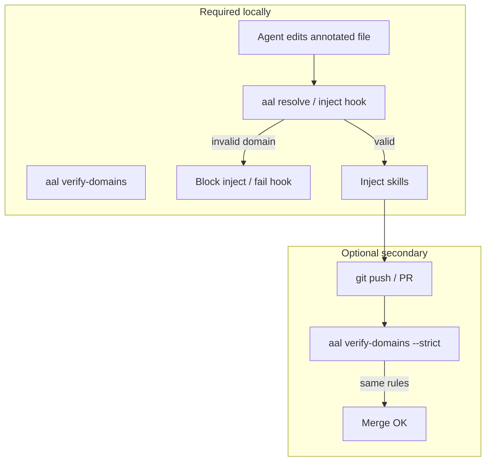
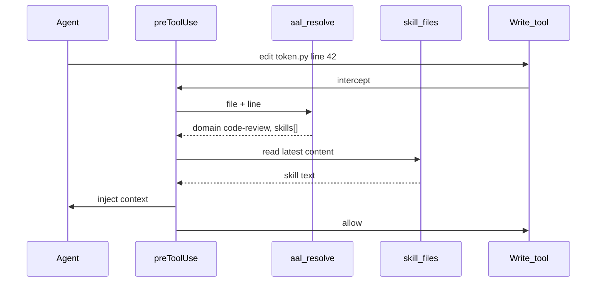

# Agentic Annotation Language (AAL)

**Standard Specification v1.3.0**

AAL is an in-band comment syntax that links source code to **domain skill documents** via compact annotations. Skills are **live** (always current), not content-hashed. **Inject-on-edit** hooks automatically load skills into agent context when annotated regions are modified.

---

## 1. Introduction

Agentic tools ignore monolithic wikis and undifferentiated rules. AAL puts **one-line annotations** beside the code they govern (`# @!code-review`) and resolves them to skill files through a **domain registry**. Enforcement is **automatic and transparent**: hooks inject skill content on edit without user action.

### 1.1 What AAL is

| AAL is | AAL is not |
|--------|------------|
| Domain labels in comments | A programming language |
| A registry linking domains → skill files | Content-hash lockfiles in source |
| Inject-on-edit for agents | A replacement for code review or tests |
| Structural validation via `verify-domains` | Proof that generated code follows skill rules |

### 1.2 Core concepts

| Term | Definition |
|------|------------|
| **Domain** | Named concern group (`security`, `storage`, `testing`) |
| **Skill** | Markdown under `.cursor/skills/` (bundled) or override file (repo-only) |
| **Annotation** | Comment directive, e.g. `# @!code-review` |
| **Registry** | `.cursor/domains.yaml` — maps each domain to one or more skill paths |
| **Resolution** | Process of mapping an edit target → effective annotation → skill files |

### 1.3 Enforcement model

AAL separates **behavior at edit time** from **annotation validation**. Both use the same domain registry; validation uses **one shared command** everywhere.

| Layer | Required? | Mechanism | What it does |
|-------|-----------|-----------|--------------|
| **IDE — inject** | **Yes** (primary) | Cursor/Claude hook on Write/Edit | Resolves annotation → injects skills (§7) |
| **IDE — validate** | **Yes** (same hook or pre-commit) | `axiompy-skills verify-domains` | Ensures annotations resolve; blocks if not |
| **Host glue** | Installed with hooks | `.cursor/rules/aal.mdc`, `CLAUDE.md` | Tooling-specific workflow: respect `# @!`, trust inject — **not** policy text |
| **CI/CD** | Encouraged (week 2+) | Pinned package + `axiompy-skills doctor --strict` + `axiompy-skills verify-domains --strict` | Validates **committed** registry, skills, and annotations |

**Host glue vs policy:** Skills define *what*; annotations define *where*; hooks connect skills to edits; rules/CLAUDE.md tell agents *how* to participate on that host. See [AAL-grill-questions.md](./AAL-grill-questions.md) Q14.



**Principle:** Local hooks and CI use the **same validation logic** (`verify-domains`) against the **same committed files** in git. CI does not run inject; it proves the repo tree CI checked out contains every domain, skill, and hook path the team relies on.

**Default:** `enforcement: inject` in `.cursor/aal.yaml` (see §7).

**Repo policy:** AAL-enabled repositories **commit** `.cursor/` (registry, manifest, bundled skills) and `.cursor/` (hooks, rules). Do not gitignore project hooks or skills. See §6.2.

---

## 2. Compact annotation syntax

### 2.1 Primary form

```python
# @!code-review
```

One line. Means:

1. This scope (file or function) is governed by the **security** domain.
2. **Load is implied** — when an edit touches this scope, inject all skills listed for `security` in `domains.yaml`.

### 2.2 Multiple domains

```python
# @!code-review,storage
```

Both domains apply; inject loads all skills listed for each domain in `domains.yaml`.

**Limits and guidance:**

| Rule | Enforcement |
|------|-------------|
| **Max 3 domains** per annotation (file or function) | `verify-domains --strict` **errors** if more than three |
| **More than one domain** on a file-level annotation | **Warning** in `bootstrap suggest` / `verify-domains` — likely mixed concerns; review design |
| **Incompatible domain pairs** | **Warning** (configurable in `.cursor/bootstrap.yaml`) — e.g. `customer` + `testing` suggests misplaced test code |

Prefer **one domain** at file level when possible. Use multi-domain file-level when the **whole file** legitimately needs all listed practice sets on every edit. Use **function-level** overrides when different functions need **different** domain subsets — not the same multi-domain line on the whole file.

```python
# @!code-review,storage          # OK: file-wide data+auth layer (max 3)

# @!general
def healthcheck(): ...

# @!code-review
def hash_password(...): ...   # Better than # @!general,security,testing on the file
```

---

The **core standard** is domain declaration only:

```python
# @!code-review
# @!code-review,storage
```

Place annotations at **file** or **function** level (§4). Renaming a function does not remove the annotation — it stays on the scope where you placed it.

**Import and library choices** (e.g. use `bcrypt`) belong in **skill documents**, not in annotation syntax. Future tooling may flag when code diverges from skill guidance (implementation backlog).

**Extensions** (optional, advanced): `load=none`, `@!guard`, and additional trigger kinds — see **§3**. Implementations MUST support §2; MAY support §3.

### 2.4 Reserved names

These may not be used as domain names: `ref`, `load`, `guard`, `domain`, `aal`, `begin`, `end`.

Domain names: lowercase `[a-z][a-z0-9-]*`.

---

## 3. Advanced: guard directives (optional extension)

> **Not required for most repos.** Primary enforcement is `# @!domain` with automatic inject. Guards are for conditional loads in specialized cases. The AAL standard is **open for extension** — implementations ship a **small baseline** first and add trigger kinds over time.

Guards add conditional skill loads when combined with `load=none`, or supplemental reads in advanced setups.

**v1 baseline triggers (recommended minimum):**

| Kind | Example | Matches when |
|------|---------|--------------|
| `keyword:word` | `when=keyword:migration` | Edit intent or diff contains `word` |
| `always` | `when=always` | Every edit to the hosting file |

**Extension triggers** (may be added in later releases): `symbol:`, `import:`, `path:`.

When multiple triggers appear in one `when=` clause, comma means **AND** (all must match).

```python
# @!design-patterns,load=none

# @!guard when=keyword:migration then=read:storage
def run_migration(conn) -> None:
    ...
```

Routine edits to other functions in the file load nothing until a guard fires.

### 3.1 Read targets

`then=read:security` resolves via `domains.yaml` to all skills in the **security** domain.

`then=read:security/jwt` (optional) resolves to a specific skill file when named in registry metadata.

**Do not use guards** to encode import rules (e.g. `import:bcrypt*`) — document imports in the skill file for the domain instead.

---

## 4. Placement and precedence

Annotations may appear at **file**, **function**, or **directory** level.

### 4.1 File level (top of file only)

**MUST** appear at the **top of the file** — after an optional module docstring, before other code (imports, constants, functions). One file-level annotation sets the **default domain(s) for the entire file**:

```python
# @!code-review

import bcrypt

def helper():
    ...
```

Multi-domain at file level uses one line: `# @!code-review,storage`.

`verify-domains --strict` **errors** if a file-level annotation appears outside the header region (implementation-defined: before the first `def` / `class` / top-level function, or within the first `header_scan_lines` lines).

### 4.2 Function level (overrides file default)

Immediately above a function (or method). **Overrides** the file-level default for that function only:

```python
# @!general

def healthcheck():
    ...

# @!code-review
def hash_password(plain: str) -> str:
    ...
```

Renaming `hash_password` does not remove the annotation — it stays on the line above the function.

`verify-domains --strict` **errors** if a mid-file `# @!domain` is not immediately above a recognized function boundary (heuristic in v1; optional AST later).

### 4.3 Directory default (optional)

`.aal-dir.yaml` in a source directory:

```yaml
domain: security
```

Files in that tree inherit unless overridden at file or function level.

### 4.4 Precedence (most specific wins)

```text
function annotation  >  file annotation  >  directory default
```

When resolving an edit at line *L*, use the **nearest function-level annotation at or before line *L*** within that function's scope; otherwise use the **file-level default**; otherwise use the **directory default**.

### 4.5 Scanning and discovery

Implementations **MUST parse the entire file** (per scanned path) to discover file-level and function-level annotations and build a scope map. This is required because function overrides can appear anywhere in the file.

```yaml
# .cursor/aal.yaml
scan_entire_file: true    # default — MUST for correct function-level discovery
header_scan_lines: 50     # defines "top of file" window for file-level placement checks
ignore_dirs:              # skip generated/vendor trees (§4.6)
  - .git
  - node_modules
  - vendor
  - dist
  - build
```

| Setting | Behavior |
|---------|----------|
| **`scan_entire_file: true`** (default) | Full-file parse; file-level at top + all function overrides found |
| **`scan_entire_file: false`** | Deprecated for team repos — may miss function annotations; not recommended |

**On inject:** `axiompy-skills resolve --file PATH --line N` parses the whole file (or uses a cached parse) to resolve effective domain(s) at line *N*.

### 4.6 Ignored paths (generated / vendor)

Do not annotate **generated** or **vendor** code (e.g. `vendor/`, `node_modules/`, `**/generated/**`, build output). These paths are excluded via `ignore_dirs` and `extensions` in `.cursor/aal.yaml`. `verify-domains` skips ignored paths — same pattern as other linters.

---

## 5. Domain registry

**Path:** `.cursor/domains.yaml`

```yaml
domains:
  security:
    summary: "Auth, crypto, secrets"
    skills:
      - .cursor/skills/security/core.md
      - .cursor/skills/security/jwt.md
  storage:
    summary: "SQL, migrations"
    skills:
      - .cursor/skills/storage/sql.md
  testing:
    skills:
      - .cursor/skills/testing/mocks.md
  general:
    skills:
      - .cursor/skills/general/conventions.md
```

| Field | Required | Purpose |
|-------|----------|---------|
| `skills` | Yes | List of repo-relative skill file paths |
| `summary` | No | One-line description for `axiompy-skills explain` |

Multiple skills per domain are first-class. Inject-on-edit loads all listed skills for the effective domain annotation.

**AxiomPy composition (v1.3):** List only `SKILL.md` paths in `domains.yaml`. Shared cross-cutting packages (`code-style`, `design-patterns`, …) are composed alongside domain folders (`storage/`, `io/`, …). Other `*.md` files in the same folder as a listed `SKILL.md` are **sidecars** — merged automatically by `merge_skill_content` at inject. Do not list sidecar paths in the registry (duplicate load). There is no `@include` directive inside skill markdown. See [axiompy-mapping.md](./axiompy-mapping.md).

Skill documents SHOULD specify expected imports and libraries (e.g. preferred crypto packages). Alignment between code and skill guidance is validated by tooling over time (see implementation backlog) — not by guard predicates in source.

### 5.1 Skill overrides (repo-only, never overwritten)

Do **not** edit bundled skill files in place. Company-specific rules use a paired override file in the same domain directory:

| Bundled (manifest) | Override (preserved on upgrade) |
|--------------------|----------------------------------|
| `.cursor/skills/security/core.md` | `.cursor/skills/security/core.override.md` |

**Naming:** `<domain>.override/SKILL.md` beside `{stem}.md` under `.cursor/skills/{domain}/`.

**Required frontmatter:**

```markdown
---
aal: skill-override
domain: security
target: core.md
mode: append
---

# Company security overrides

## Supersedes
### Encryption
Use AWS KMS `alias/prod-auth` for all at-rest encryption.

## Adds
- OAuth tokens must use RS256 with Vault keys.
```

| Field | Required | Values |
|-------|----------|--------|
| `aal` | Yes | `skill-override` |
| `domain` | Yes | Must match parent directory |
| `target` | No | Bundled filename (e.g. `core.md`); omit for company-only skills |
| `mode` | No | `append` (default) or `replace` |

Overrides are **auto-discovered** (glob `**/*.override.md`) — no edit to bundled `domains.yaml` required.

Optional **`.cursor/domains.local.yaml`** (not in manifest) registers company-only domains:

```yaml
domains:
  payments:
    skills:
      - .cursor/skills/payments/stripe.override.md
```

**Inject:** `append` loads bundled then override; `replace` loads override only. **`verify-domains`** validates override frontmatter and that `target` exists when set.

### 5.2 Bootstrap config (existing repos)

**Path:** `.cursor/bootstrap.yaml` (repo-authored; not replaced by `axiompy-skills upgrade`)

Used by `axiompy-skills bootstrap suggest` and `axiompy-skills bootstrap apply --level file` to map legacy files → domains.

```yaml
p0_globs:
  - "src/**"
  - "lib/**"

default_domain: general
max_domains_per_annotation: 3
warn_if_domains_count_gt: 1

path_hints:                    # first matching glob wins (longest match recommended)
  - glob: "src/auth/**"
    domain: security
  - glob: "src/payments/**"
    domains: [security, storage]

incompatible_pairs:            # bootstrap warning — likely bad module design
  - [customer, testing]
```

| Field | Purpose |
|-------|---------|
| `p0_globs` | Files eligible for phase-1 bootstrap |
| `path_hints` | `domain` or `domains` (max 3) suggested for matching paths |
| `default_domain` | Fallback when no hint matches |
| `incompatible_pairs` | Warn when suggestion contains both domains in a pair |
| `warn_if_domains_count_gt` | Warn when file-level annotation would list more than N domains |

Phase-1 apply inserts **file-level only** annotations. Phase-2 function refinement is post-MVP (see §8).

---

## 6. Workspace configuration

**Path:** `.cursor/aal.yaml`

```yaml
version: "1.3"
skills_package: axiompy
skills_package_version: "1.3.0"
enforcement: inject          # inject | cache | deny
scan_entire_file: true
header_scan_lines: 50      # used when scan_entire_file: false
ignore_dirs:
  - .git
  - node_modules
  - __pycache__
  - venv
  - .venv
  - vendor
  - dist
  - build
extensions:
  - .py
  - .ts
  - .js
  - .go
  - .rs
  - .java
  - .sql
  - .vue
  - .html
  - .sh
```

### 6.1 Enforcement modes

| Mode | Behavior | User visibility |
|------|----------|-----------------|
| **`inject`** (default) | Hook reads skills and injects into agent context before Write proceeds | Silent — most automatic |
| **`cache`** | Inject once per domain per session; cache invalidated on skill mtime change | Silent after first edit |
| **`deny`** | Block Write until agent explicitly reads skill files | Visible retries |

### 6.2 Committed repository layout

AAL provisioning produces **repo artifacts that must be committed to git**. CI validates the checked-out tree — it does not run a fresh `axiompy-skills install` on every PR.

```text
my-service/
├── .cursor/
│   ├── aal.yaml
│   ├── domains.yaml
│   ├── .axiompy-manifest.json       # paths owned by aal upgrade
│   ├── domains.local.yaml       # optional; not in manifest
│   └── skills/                  # bundled + *.override.md
├── .cursor/
│   ├── rules/aal.mdc
│   ├── hooks.json
│   └── hooks/aal-inject.sh
├── requirements-dev.txt         # axiompy==X.Y.Z (pinned)
├── .github/workflows/aal-gate.yml
└── src/                         # # @!domain annotations
```

| Rule | Rationale |
|------|-----------|
| **Do not gitignore `.cursor/`** | Hooks and rules are part of the contract; CI and every developer use the same inject path |
| **Commit `.cursor/skills/`** | CI `verify-domains` requires skill files on disk in the PR |
| **Pin package in requirements** | CI installs the same tooling version the team agreed on |
| **Commit after `axiompy-skills install` / `axiompy-skills upgrade`** | PR reviewers see skill and config changes with dependency bumps |

Global-only installs (`~/.cursor/skills` without project commit) are for personal experiments — not for team AAL repos.

---

## 7. Inject-on-edit (Tier 2 contract)

When an agent invokes **Write** or **Edit** on a path:

1. Determine edited **line range** (and symbol when available).
2. Resolve **effective annotation** (precedence §4.4; scanning §4.5).
3. Load `domains.yaml` → skill file paths for effective domain(s).
4. If guards present (§3, optional), evaluate against edit intent; merge conditional reads.
5. Read skill files from disk (bundled + overrides §5.1).
6. **Inject** content into the agent turn.
7. Allow Write to proceed.



The user does **not** run CLI commands during edit. Failed inject (missing skill file) surfaces as hook error; fix with `axiompy-skills verify-domains` or re-run `axiompy-skills upgrade` if files are missing from the committed tree.

### 7.1 Hook integration (Cursor)

Project hook on `preToolUse` with matcher `Write|Edit`:

```bash
.cursor/hooks/aal-inject.sh
```

Calls:

```bash
aal resolve --file "$FILE" --line "$LINE" --json
```

Returns skill paths and content for injection. **`axiompy-skills resolve` must fail** if validation would fail (unknown domain, missing skill) — same rules as `verify-domains`. See [AAL-deployment-guide.md](./AAL-deployment-guide.md) §3 and §6.

### 7.2 Middleware API (orchestrators)

```python
from aal.middleware import EditIntent, aal_inject_on_edit

payload = aal_inject_on_edit(".", EditIntent(
    file_path="src/auth/token.py",
    target_line=42,
    description="Fix JWT validation",
    symbols_touched=["verify_token"],
))
# payload.skills_text → prepend to agent context before generating patch
```

---

## 8. Tooling (CLI contracts)

Shipped via `pip install axiompy`. Implementation follows [AAL-implementation-backlog.md](./AAL-implementation-backlog.md).

| Command | Purpose |
|---------|---------|
| `axiompy-skills install [--hooks]` | Bootstrap manifest paths into repo (project-scoped); write `.axiompy-manifest.json` |
| `axiompy-skills upgrade [--force]` | After pip upgrade: replace all manifest paths from package; preserve `*.override.md` |
| `axiompy-skills uninstall` | Remove manifest-tracked paths; preserve overrides and `domains.local.yaml` |
| `axiompy-skills init FILE --domain NAME` | Create **new** file with `# @!NAME` |
| `axiompy-skills annotate FILE --domain NAME` | Add file-level annotation to **existing** file if missing (idempotent) |
| `axiompy-skills bootstrap suggest` | Scan `bootstrap.yaml` P0 globs → suggested domain(s) + warnings |
| `axiompy-skills bootstrap apply --level file` | Bulk insert file-level annotations only; `--dry-run` default |
| `axiompy-skills annotate FILE --function NAME --domain D` | **Post-MVP:** Function-level override (phase 2) |
| `axiompy-skills bootstrap refine FILE` | **Post-MVP:** Prompt for function-level customization |
| `axiompy-skills bootstrap report --mixed` | **Post-MVP:** Files needing phase-2 review |
| `axiompy-skills coverage report` | **Post-MVP:** Unannotated P0 paths |
| `axiompy-skills resolve --file PATH [--line N]` | JSON: domains, skills, inject content (for hooks) |
| `axiompy-skills explain FILE [--line N]` | Human-readable resolution |
| `axiompy-skills verify-domains [--strict] [--files PATH...]` | **Shared validator** — annotations, placement, overrides, skills on disk |
| `axiompy-skills refresh --check` | Optional preview diff vs package before upgrade |
| `axiompy-skills doctor [--strict]` | Installation health; version drift vs `aal.yaml` |
| `axiompy-skills override init --domain D --target T` | Scaffold `{target}.override.md` |
| `axiompy-skills impact DOMAIN` | Files referencing a domain |
| `axiompy-skills skills` | List bundled domains |

**Not in v1.3 MVP:** `freeze`, content hashes, `DRAFT` state, guards (§3), `.aal-dir.yaml` directory defaults, `explain` / `impact` / `graph`, Claude middleware, skill-import alignment, bootstrap phase 2 (`refine`, `annotate --function`, `coverage report`), skill rule **severity** levels.

See **§8.2 MVP scope** and grill Q18.

### 8.2 MVP scope (v1.3.0)

**Ship:**

| Area | Includes |
|------|----------|
| **Syntax** | `# @!domain`; multi-domain comma-separated (**max 3**); file + function placement |
| **Registry** | `domains.yaml`, `<domain>.override/SKILL.md`, `domains.local.yaml` |
| **Install** | `install --hooks`, `upgrade`, `uninstall`, `doctor --strict`, committed `.cursor/` + `.cursor/` |
| **Inject** | `resolve`, `preToolUse` hook, host glue (`aal.mdc`) |
| **Validate** | `verify-domains --strict --files`; multi-domain cap; warnings for >1 domain / incompatible pairs |
| **Bootstrap (phase 1)** | `bootstrap.yaml`, `bootstrap suggest`, `bootstrap apply --level file`, `annotate` (file-level) |
| **New files** | `axiompy-skills init` |
| **CI template** | `doctor` + `verify-domains --files` on changed paths |

**Defer (post-MVP):**

| Area | Deferred |
|------|----------|
| Bootstrap phase 2 | `bootstrap refine`, `annotate --function`, `report --mixed`, `coverage report` |
| Guards | §3 optional DSL |
| Directory defaults | `.aal-dir.yaml` |
| Diagnostics | `explain`, `impact`, `graph` |
| Hosts | Claude middleware (API stub docs only) |
| Quality | Skill-import alignment; skill severity (`error`/`warning`/`info`) |
| Nice-to-have | `refresh --check`; AST placement resolver |

**Planned (post-MVP):** Skill rule **severity** — bootstrap and verify respect `--min-severity` for progressive fixes.

### 8.1 Unified validation (`verify-domains`)

One implementation, one ruleset, invoked from:

| Context | When | Command | Required? |
|---------|------|---------|-----------|
| **Inject hook** | Before inject on Write/Edit | `axiompy-skills resolve` (internally validates) or explicit `verify-domains` | Yes |
| **Pre-commit** | Before commit | `axiompy-skills verify-domains --strict` | Recommended |
| **CI/CD** | On PR / push | `axiompy-skills doctor --strict` then `axiompy-skills verify-domains --strict --files <changed>` | Encouraged |

**Same checks everywhere:**

1. Every `# @!domain` references a defined domain in `domains.yaml` (or `domains.local.yaml`)
2. **Placement ( `--strict` ):**
   - At most one file-level annotation, at top of file (§4.1)
   - Function-level annotations immediately above a function (§4.2)
   - No orphan mid-file `# @!domain` lines
3. Every skill path in the registry exists on disk in the **committed repo**
4. Every `*.override.md` has valid frontmatter (§5.1)
5. With `--strict`: `skills_package_version` matches installed package (`axiompy-skills doctor --strict`)
6. Paths under `ignore_dirs` are skipped (§4.6)

Optional (§3): if guards present, validate `then=read:domain` targets resolve.

**CI contract:** checkout repo → `pip install -r requirements-dev.txt` → `axiompy-skills doctor --strict` → `axiompy-skills verify-domains --strict --files $(git diff --name-only ...)`. CI validates **changed files** in the PR (not necessarily the entire monorepo). Optional full-repo verify on main/nightly. CI does **not** run `axiompy-skills install` or inject.

**Different responsibilities:**

- **Inject hook** — behavior: load skills into agent context (IDE only)
- **verify-domains** — structure: annotations and on-disk files are valid (local + CI)

### 8.2 Source of truth: committed repo tree

**Confirmed:** `verify-domains`, `resolve`, and inject hooks read the **checked-out repository**:

```text
.cursor/domains.yaml       ← domain definitions
.cursor/skills/**          ← bundled skills + *.override.md
.cursor/aal.yaml           ← enforcement mode, skills_package_version
.cursor/.axiompy-manifest.json ← paths replaced by aal upgrade
.cursor/hooks/**          ← inject hook (committed)
```

They do **not** read skill markdown from `site-packages` during normal operation.

| Component | Source at runtime |
|-----------|-------------------|
| **CLI / validator code** | Installed `axiompy` (pinned in `requirements-dev.txt`) |
| **Domain registry** | Committed `.cursor/domains.yaml` (+ optional `domains.local.yaml`) |
| **Skill content (inject)** | Committed `.cursor/skills/` on disk |
| **Hooks** | Committed `.cursor/hooks/` |
| **Annotation scan** | Repo source files (`src/`, etc.) |

**Package upgrade flow:**

```bash
pip install -U axiompy
aal upgrade --force                 # replace manifest paths; preserve overrides
git add .cursor/ .cursor/ requirements-dev.txt
git commit -m "chore: upgrade axiompy"
aal verify-domains --strict
```

Do **not** edit bundled skill files directly — use `<domain>.override/SKILL.md` (§5.1).

### 8.3 Package upgrade (full overwrite)

`pip install -U` updates tooling in `site-packages` only. **`axiompy-skills upgrade`** replaces every path listed in `.cursor/.axiompy-manifest.json` from the current package bundle.

| Path class | On `axiompy-skills upgrade` |
|------------|------------------|
| Manifest paths (bundled skills, `domains.yaml`, hooks, CI template, `aal.yaml` defaults) | **Replaced** from package |
| `**/*.override.md` | **Preserved** |
| `.cursor/domains.local.yaml` | **Preserved** |

**Workflow:**

```bash
pip install -U axiompy
aal refresh --check                 # optional: preview diff before upgrade
aal upgrade --force                 # warn if dirty; --force to proceed
aal doctor --strict
aal verify-domains --strict
git add .cursor/ .cursor/ requirements-dev.txt && git commit
```

**Principle:** Package owns bundled defaults; repo commits the provisioned tree. Customization is explicit via override files — never silent edits to bundled skills.

### 8.4 Audit trail (compliance / post-incident)

v1.3 does **not** pin skill content in source annotations. Audit uses **two reconcilable artifacts**:

| Artifact | What it records | Where |
|----------|-----------------|--------|
| **Package pin** | Exact `axiompy` version (and wheel digest) used in CI/dev | `requirements.txt`, lockfile, Artifactory/Nexus/PyPI |
| **Repo skills snapshot** | Skill text agents consumed (bundled + overrides) | Git history of `.cursor/skills/` at merge commit |
| **Metadata** | Declared package baseline | `.cursor/aal.yaml` → `skills_package_version` |

**Reconciliation (not direct inline link):**

```text
PR #847 merge commit
  ├── git tree: .cursor/skills/security/core.md  @ commit SHA  (what inject used)
  ├── CI log:   axiompy==1.3.0              (pinned dependency)
  └── Artifactory digest: sha256:abc…           (immutable package artifact)
         └── bundled skills at 1.3.0           (reference defaults for diff)
```

Security can answer *“what governed auth?”* by:

1. **Git** — skill files at the PR merge commit (source of truth for inject).
2. **Package manager** — which `axiompy` version CI and developers installed.
3. **Artifactory digest** — immutable hash of that package wheel; reproduces bundled skill defaults.
4. **Diff** — git tree at merge vs extracting skills from the pinned wheel shows override deltas (`*.override.md`).

`skills_package_version` alone is **not** sufficient for audit — it is a drift hint. The audit pair is:

- **Pinned package version + artifact hash** (tooling + bundled defaults)
- **Git commit of `.cursor/skills/`** (bundled + overrides committed together)

**CI recommendation:**

```yaml
- run: pip install -r requirements-dev.txt
- run: aal doctor --strict
- run: aal verify-domains --strict
```

Optional: log wheel digest (`pip hash axiompy`) and `git rev-parse HEAD:.cursor/skills` in build artifacts.

No per-annotation content hashes required — reconciliation happens **across package registry + git**, which teams already manage.

### 8.5 After package upgrade

```bash
pip install -U axiompy
aal upgrade --force
aal doctor --strict
aal verify-domains --strict
git add .cursor/ .cursor/ requirements-dev.txt
git commit -m "chore: upgrade axiompy"
```

---

## 9. Formal grammar (EBNF)

```ebnf
annotation_line  ::= comment_prefix compact_directive
compact_directive ::= "@!" domain_list [ "," load_modifier ]*
domain_list      ::= domain_name ( "," domain_name )*
domain_name      ::= [a-z] [a-z0-9-]*
load_modifier    ::= "load=none" | "load=guard" | "load=yes"
guard_directive  ::= "@!guard" space "when=" trigger_list space "then=" read_list
trigger_list     ::= trigger ( "," trigger )*
trigger          ::= trigger_kind ":" pattern
trigger_kind     ::= "symbol" | "import" | "path" | "keyword" | "always"
read_list        ::= "read:" read_target ( "," "read:" read_target )*
read_target      ::= domain_name [ "/" segment ]
comment_prefix   ::= "#" | "//" | "--" | ";;" | "<!-- ... -->"
```

---

## 10. Language comment mappings

| Class | Extensions | Prefix |
|-------|------------|--------|
| Scripting | `.py`, `.sh`, `.rb`, `.yml` | `#` |
| C-style | `.ts`, `.js`, `.go`, `.java`, `.rs`, `.vue` | `//` |
| SQL | `.sql` | `--` |
| Lisp | `.clj`, `.lisp` | `;;` |
| Markup | `.html`, `.xml` | `<!-- -->` |

---

## 11. Package and skills library

`axiompy` ships:

- Default **domains** and **skill** markdown files
- CLI and middleware
- Templates: Cursor rules, hooks, CI workflow

Repos run `axiompy-skills install --hooks`, **commit** `.cursor/` and `.cursor/`, and pin `axiompy` in `requirements-dev.txt`. Package upgrades use `axiompy-skills upgrade`; company rules use `<domain>.override/SKILL.md` (§5.1).

---

## Related documents

| Document | Purpose |
|----------|---------|
| [AAL-examples.md](./AAL-examples.md) | Copy-paste patterns |
| [AAL-deployment-guide.md](./AAL-deployment-guide.md) | Cursor, Claude, CI rollout |
| [AAL-implementation-backlog.md](./AAL-implementation-backlog.md) | Future build order |
